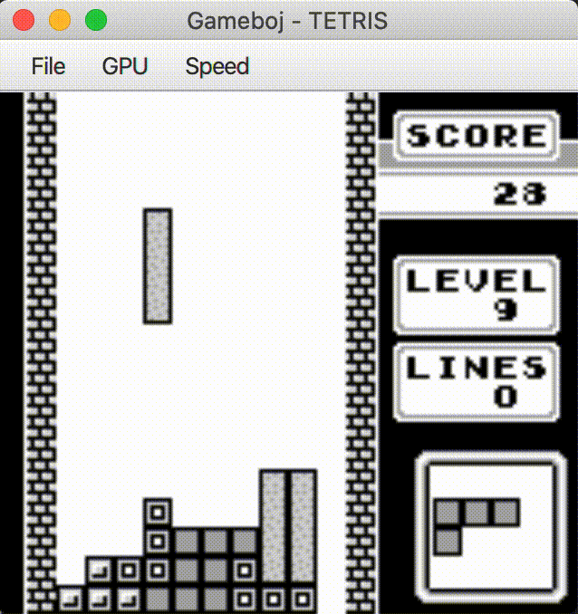
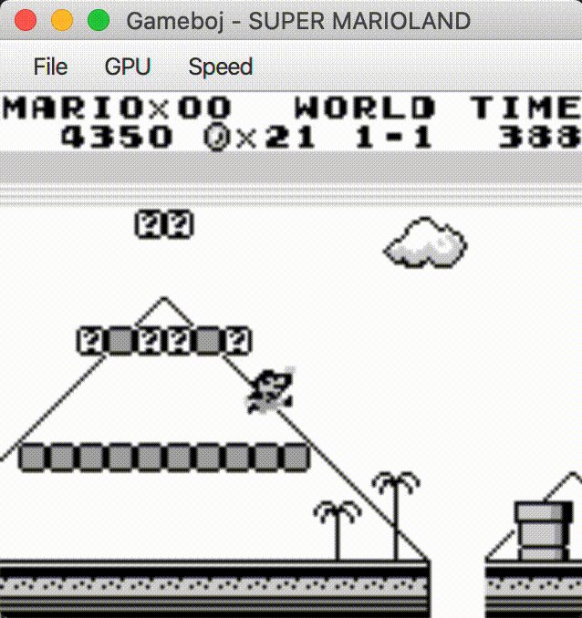
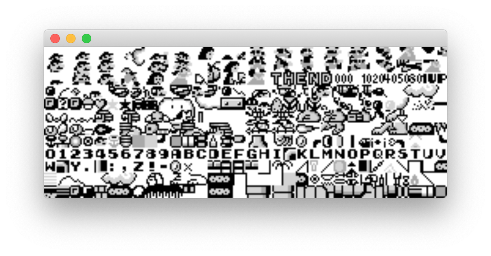

# Gameboj

Gameboj is a complete Nintendo Game Boy of 1989 emulator written from scratch in Java.
Any game cartridge can be downloaded as a .gb file and played on the emulator. 

The original Sharp LR35902 processor is emulated on a very low level. Bus controller, ROM, RAM,
Direct Memory Accesses (DMA), screen controller etc... are implemented according to the
original Nintendo specs. 

Moreover, I added special functionality that lets the user fiddle 
with the play speed, analyse the video memory (tiles, sprites, background window) and capture 
a screenshot.

## Emulated parts

* Bus, ROM and RAM controllers
* Arithmetic logic unit (ALU) of the CPU
* Registers and "high RAM" of the CPU
* Decoding of arithmetic, logic and control instructions
* Direct memory access (DMA)
* Screen controller
* Timer and keyboard interrupts
* Booting from a cartridge

## Gameplay
### Tetris

### Super Mario Land

### The tiles in Super Mario Land

